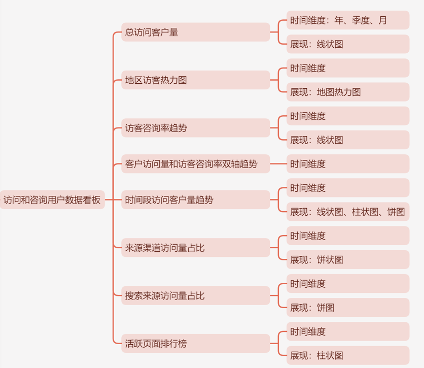
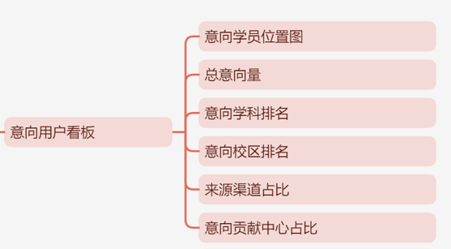
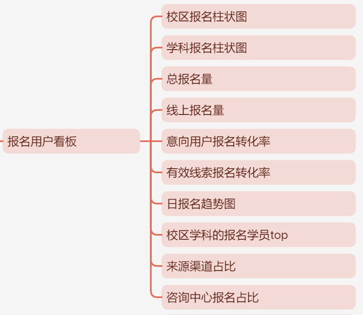
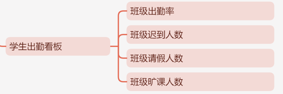
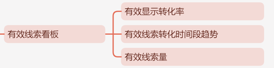
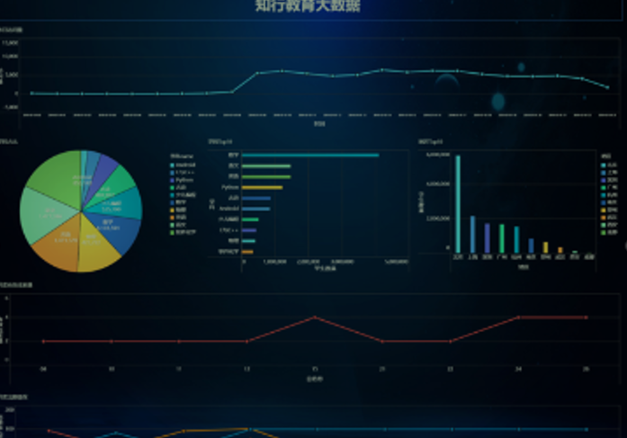

1.包含了需求分析、设计转换、研发、测试到上'线部署维护的完整项目流程。
2.真实的教育大数据业务逻辑，包括：访问、咨询、意向、线索、报名、考勤等
各个阶段，大幅提升学员在教育行业中的竞争力。
3.深入讲解数据仓库的分层与建模过程。

4.海量数据场景下的性能优化。
5.拉链表的具体应用、对变化的更新数据进行存储和分析。
6.每个公司都会要求使用的版本控制工具。gt
7.大公司、核心项目必备的Code Review:技能。
8.可视化部署与运维大数据环境。

 

数仓：

ods

dw

app

 

模型：星型模型、雪花模型、星座模型

 

 

 

## 1.实训课程目标

 

## 2.项目介绍

项目名称：知行教育大数据分析平台
所属行业：k12教育行业
项目背景

行业背景：
       近几年，行业发展比较不错。.数据量增加，传统的数据库无法支持海量数据的计算与存储。所以我们产生了这样的大数据平台
为什么学
       近半年时间，整个行业出现了要新下降，导致大量K12程序员开始挑工作
企业痛点：

- 数据量增多
- 系统同多，数据分散
- 分析准度大，数据混乱

## 3.教育项目业务需求

五大模块

- 访问和咨询用户数据看版
  
    
- 意向用户看版
  
  

- 报名用户看版
  
  
- 学生出勤看版
  
  
- 有效线索看版
  
  

 

## 4.技术框架

### 4.1数据流程

- 数据分层
  - ODS
  - DW
- mysql
- BI展示工具
- oozie实现调度

### 4.2数据用到的技术

- hadoop
- hive
- sqoop